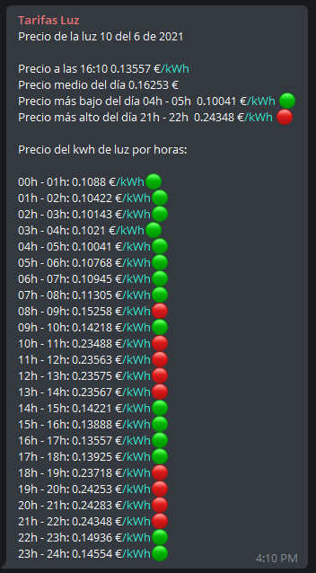

# New electricity tariffs in Spain

This Telegram bot uses Python and Beautifulsoup to download the day's pricing information for new electricity tariffs.

It sends a message with the breakdown of all the hours of the day and some statistics about minimum, maximum and average price.

## Setup

It is necessary to create a configuration file to parameterize the fields related Telegram, colors and download url.

The file will be called config.py and will go inside the root folder.

It will have the following structure:

```python
# Telegram
TELEGRAM_TOKEN = "AAAAGGGGGG"

# Source
SOURCE = "https://tarifaluzhora.es/"

# Emoji
RED_CIRCLE = '\U0001F534'
GREEN_CIRCLE = '\U0001F7E2'
```

## Use
Build docker image:
```
docker image build -t light_bot .
```

Using docker:
```
docker container run -d --rm -it light_bot
```

## Example
